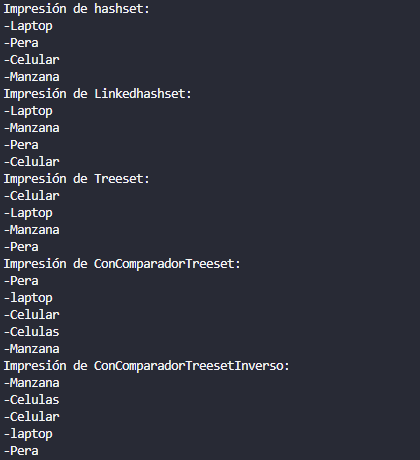
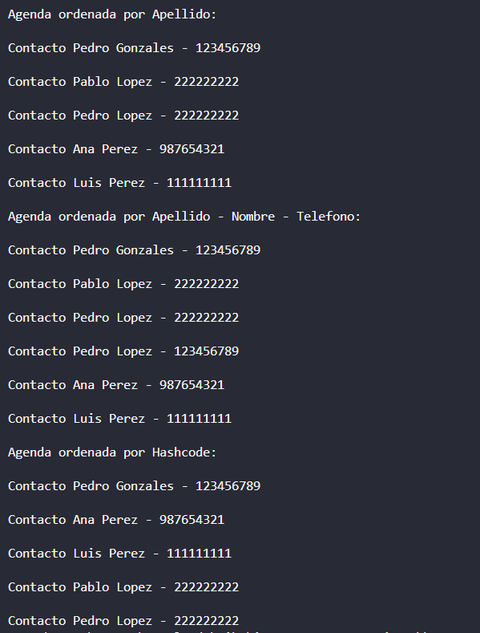

# Práctica de Sets

## 📌 Información General

- **Título:** Práctica de Sets
- **Asignatura:** Estructura de Datos
- **Carrera:** Computación
- **Estudiante:** Michael Yumbla
- **Fecha:** 07/01/2025
- **Profesor:** Ing. Pablo Torres

---

## 🛠️ Descripción

Esta clase Java llamada Sets, ubicada en el paquete controllers, contiene varios métodos para construir diferentes tipos de conjuntos (Set) en Java utilizando diversas implementaciones y criterios de ordenamiento.

Descripción general:
HashSet: Almacena elementos sin un orden específico. No permite duplicados.

LinkedHashSet: Mantiene el orden de inserción y tampoco permite duplicados.

TreeSet: Ordena automáticamente los elementos de forma natural (alfabéticamente en el caso de Strings).

TreeSetConComparador: Usa un comparador personalizado para ordenar por longitud de las cadenas, y en caso de empate, alfabéticamente.

TreeSetConComparadorInverso: Igual que el anterior, pero ordena de forma descendente por longitud, y luego alfabéticamente.

---

## 🚀 Ejecución

Para ejecutar el proyecto:

1. Compila el código:
    ```bash
    javac App.java
    ```
2. Ejecuta la aplicación:
    ```bash
    java App
    ```

---

## 🧑‍💻 Ejemplo de Entrada

```plaintext
Impresión de hashset: 
-Laptop
-Pera
-Celular
-Manzana
Impresión de Linkedhashset:
-Laptop
-Manzana
-Pera
-Celular
Impresión de Treeset:
-Celular
-Laptop
-Manzana
-Pera
Impresión de ConComparadorTreeset:
-Pera
-laptop
-Celular
-Celulas
-Manzana
Impresión de ConComparadorTreesetInverso:
-Manzana
-Celulas
-Celular
-laptop
-Pera

```
# IMAGEN 

---
# IMAGEN 2


